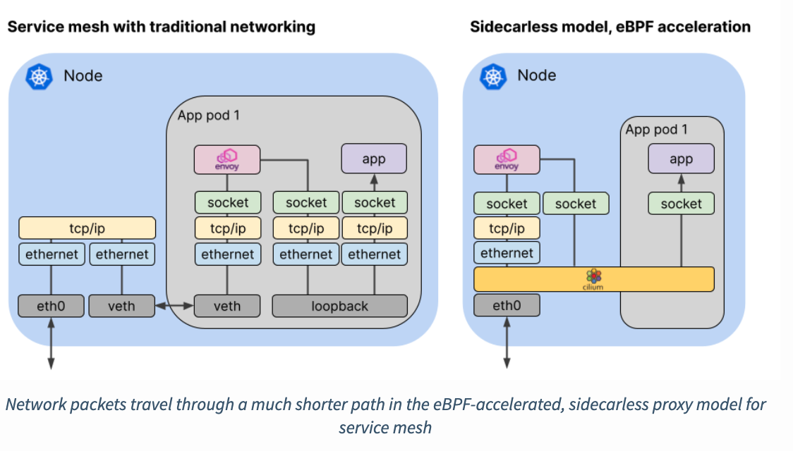

# Cilium tutorial


## What good for

- 기존 사이드카 모델이 가진 한계점 보완
  - 사이드카 모델의 경우, 무조건 사이드카로 붙은 프록시를 통해 접근해야 하기 때문에 overhead가 발생할 수 밖에 없음
    - 기존 flow: app1 -> sideCarProxy -> sideCarProxy -> app2
      - Inbound packet -> get host TCP/IP -> sideCarProxy -> application
      
    - when using cilium: App1 -> sideCarPorxy -> App2
      - inbound packet -> cilium -> app
      
        




## prerequisite

- minikube

## 설치하기

```bash
./minikube_cilium.sh install
```

- 미니큐브 (노드 갯수 2) 생성
- metallb , ingress, cilium-service-mesh, hubble(UI) 설치

## Path-based Routing 

```
./minikube_cilium.sh test_ingress

# UI로 확인
cilium hubble ui
```

- Path에 따른 traffic routing 확인
- hubble UI 확인 (NS: default )
  - 접속 가능한 경로 / 주소
    - {ADDR}/
    - {ADDR}/details/
    - {ADDR}/details/{id} // ex) {ADDR}/details/1
  - 불가능한 경로 - rating은 review 통해서만 접근 가능함
    - {ADDR}/rating 
    - {ADDR}rating/{id}

## L7 Traffic Routing

```bash
# 테스트용 deploy 2개 생성 - 
cilium connectivity test --test egress-l7

# 정상작동 확인- # POD 2 개, SVC 2개 생성됨
kubectl get pods -n cilium-test --show-labels -o wide 
export CLIENT2=<client2파드명>

# cilium hubble port-forward & 

# 해당 명령어 통해, in/out traffic CLI로 확인할 수 있음
1) hubble observe -f  # 전체보기 
2) hubble observe --from-pod cilium-test/$CLIENT2 -f # CLIENT2에 해당하는 것만 보기

# hubble observe 켜둔 상태에서, 통신결과 확인해보기 
kubectl exec -it -n cilium-test $CLIENT2 -- curl -v echo-same-node:8080/
kubectl exec -it -n cilium-test $CLIENT2 -- curl -v echo-other-node:8080/

# L7 적용하기 (ciliumNetworkPolicy) istio-virtualservice와 비슷
kubectl apply -f https://raw.githubusercontent.com/cilium/cilium-cli/master/connectivity/manifests/client-egress-l7-http.yaml
kubectl apply -f https://raw.githubusercontent.com/cilium/cilium-cli/master/connectivity/manifests/client-egress-only-dns.yaml

#확인하기 
kubectl exec -it -n cilium-test $CLIENT2 -- curl -v echo-same-node:8080/
#차이점: hubble oberseve한 창을 봤을 때, 이제 http method를 식별할 수 있게됨

#현재까지 network policy가 {ADDR}/ 만 허락했기 때문에, {ADDR}/foo와 같은 리퀘스트는 허용되지 않음 - 확인
kubectl exec -it -n cilium-test $CLIENT2 -- curl -v echo-same-node:8080/foo

# 엔보이 로드밸런싱 및 policy 적용하기 (envoy config 설정) CiliumEnvoyConfig
# 여기서 rewrite,retry policy /  weight설정 / loadbalancing 등 처리할 수 있음 - istio의 destionationRule과 비슷
kubectl apply -f envoy-test.yaml

# CiliumEnvoyConfig를 통해 url rewrite policy 적용하여, 위에서 안됐던 리퀘스트가 처리될 수 있음
kubectl exec -it -n cilium-test $CLIENT2 -- curl -v echo-same-node:8080/foo


```

## 삭제

```
./minikube_cilium.sh uninstall
```


ref)

https://cilium.io/blog/2021/12/01/cilium-service-mesh-beta

https://isovalent.com/blog/post/2021-12-08-ebpf-servicemesh

https://github.com/cilium/cilium-service-mesh-beta

